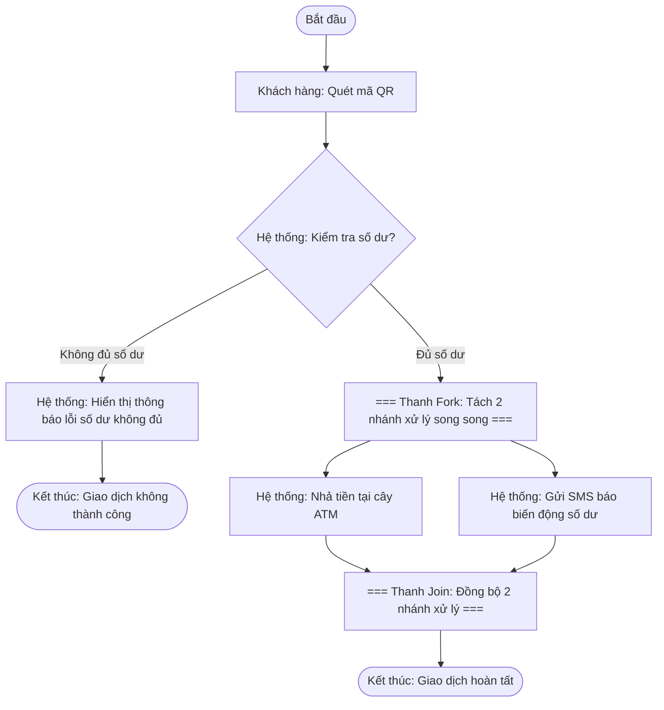

# BÁO CÁO BÀI TẬP BÀI 1 - SESSION 6: THỰC HÀNH TỔNG HỢP ACTIVITY DIAGRAM VÀ USE CASE DIAGRAM HỆ THỐNG RIKKEIBANK

> 👤 **Học viên:** Đỗ Hoàng Sơn | **Mã SV:** PTIT-HCM-066
> 🏫 **Môn học:** IT105-K25-Phan-tich-thi-t-k-h-th-ng

---

## 📊 Sơ đồ thiết kế hệ thống (Activity Diagram)

> 💡 *Sơ đồ dưới đây được render tự động trực tiếp trên GitHub bằng Mermaid. Bạn cũng có thể tải file **`bt1.drawio`** trong repository này để mở và chỉnh sửa trực tiếp trên [Draw.io (diagrams.net)](https://app.diagrams.net).* 

---

## PHẦN A — Activity Diagram (Rút tiền không thẻ tại ATM)

Hoàn thiện Bảng phân rã Node — Swimlane cho quy trình rút tiền không thẻ qua ứng dụng di động RikkeiBank tại cây ATM:

Trong quy trình này, tác vụ Quét mã QR do Khách hàng chủ động thực hiện trên thiết bị di động. Sau khi hệ thống nhận được yêu cầu, tiến trình kiểm tra điều kiện số dư tài khoản diễn ra tại luồng Hệ thống. Nếu đủ điều kiện, thanh Fork kích hoạt 2 tác vụ thực thi đồng thời: Nhả tiền vật lý tại khay ATM và Gửi tin nhắn SMS thông báo biến động số dư. Cả 2 tiến trình phải hoàn tất thành công và gộp lại tại thanh Join trước khi giao dịch đóng lại hoàn toàn.

| Loại Node | Tên Node / Tác vụ | Swimlane phụ trách |
| --- | --- | --- |
| Initial Node | Bắt đầu | — |
| Action | Quét mã QR | Khách hàng |
| Decision | Kiểm tra số dư (Đủ / Không đủ) | Hệ thống |
| Fork | Tách 2 nhánh xử lý song song khi Đủ số dư | Hệ thống |
| Action | Nhả tiền | Hệ thống |
| Action | Gửi SMS báo biến động số dư | Hệ thống |
| Join | Gộp 2 nhánh xử lý song song | Hệ thống |
| Final Node | Kết thúc | — |

## PHẦN B — Use Case Diagram (Hệ thống ATM RikkeiBank)

Hoàn thiện Bảng quan hệ giữa các Use Case trong hệ thống ATM RikkeiBank:

Trong mô hình Use Case, mối quan hệ 'include' thể hiện luồng bắt buộc: người dùng bắt buộc phải Đăng nhập (thông qua việc quét mã QR xác thực thành công) thì mới có thể thực hiện Use Case Rút tiền. Mối quan hệ 'extend' thể hiện luồng mở rộng tùy chọn: sau khi Rút tiền thành công, khách hàng có thể chọn In hóa đơn giao dịch hoặc bỏ qua. Hai hình thức 'Rút tiền tiêu chuẩn' (cho phép chọn mệnh giá/số tiền lẻ) và 'Rút tiền nhanh' (rút các định mức cố định có sẵn) đều kế thừa các tính năng cơ bản từ Use Case cha là 'Rút tiền'.

| Use Case A | Use Case B | Quan hệ | Giải thích logic |
| --- | --- | --- | --- |
| Rút tiền | Đăng nhập | [include] | Phải đăng nhập (quét mã QR) trước khi rút tiền (Bắt buộc) |
| Rút tiền | In hóa đơn giao dịch | [extend] | Khách hàng có thể tùy chọn in hóa đơn sau khi rút tiền thành công (Không bắt buộc) |
| Rút tiền | Rút tiền tiêu chuẩn | [generalization] | Là một dạng chuyên biệt của Rút tiền (Kế thừa) |
| Rút tiền | Rút tiền nhanh | [generalization] | Là một dạng chuyên biệt của Rút tiền không cần chọn mệnh giá (Kế thừa) |

## Phân Tích Logic Nghiệp Vụ Kỹ Thuật

Phân tích chuyên sâu về lý do lựa chọn mô hình hóa chuẩn UML cho cả 2 sơ đồ:

- Xử lý song song Fork/Join trong Activity Diagram: Việc tách luồng bằng thanh Fork đảm bảo trải nghiệm khách hàng tối ưu và tính toàn vẹn dữ liệu. Hệ thống vừa gửi lệnh phần cứng điều khiển khay nhả tiền của máy ATM, vừa gọi dịch vụ SMS Gateway gửi tin nhắn tức thì cho khách hàng mà không bắt một tiến trình phải chờ đợi tiến trình còn lại.
- Mối quan hệ Include vs Extend: 'Đăng nhập' là tiền điều kiện bắt buộc (include) vì nếu không có token xác thực từ mã QR, hệ thống ngân hàng tuyệt đối không được phép mở giao dịch rút tiền. Ngược lại, 'In hóa đơn' là hành vi bổ sung (extend) phụ thuộc vào nhu cầu thực tế của người dùng và lượng giấy in còn lại trong cây ATM.
- Tính kế thừa Generalization: Việc chia 'Rút tiền' thành 2 Use Case con là 'Rút tiền tiêu chuẩn' và 'Rút tiền nhanh' giúp làm rõ trải nghiệm UI/UX tại màn hình máy ATM, đồng thời giúp nhóm lập trình backend dễ dàng thiết kế Pattern Polymorphism khi xây dựng mã nguồn.

---

## 📁 Danh sách tệp tin nộp bài trong Repository
- 📝 `bt1.docx`: Báo cáo tài liệu phân tích nghiệp vụ hoàn chỉnh.
- 🎨 `bt1.drawio`: File thiết kế sơ đồ chuẩn theo quy định đề bài (mở trực tiếp bằng [Draw.io](https://app.diagrams.net) hoặc Lucidchart).
